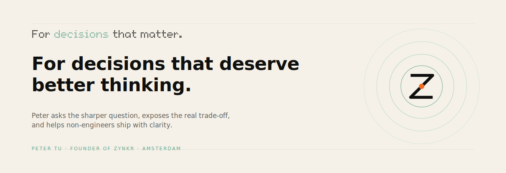

### Hi, I'm Peter — AI educator and founder of [Zynkr](https://www.zynkr.ai).

I came to coding through teaching, not the other way around. Zynkr is how I share what works: a growing marketplace of 90+ Claude skills, vibe-coding curricula, and the agents I use to run my own content and business operations.

> If you're a non-engineer trying to ship real things with AI, this profile is the playbook I'm building in public.

Based in Amsterdam · originally from Taiwan

---

## What I'm Building

### [Zynkr](https://www.zynkr.ai) — AI Skills Marketplace
Browsable directory of 90+ Claude skills for course students. Stack: Next.js + Supabase + Vercel.

### [zynkr-skill-builder](https://github.com/peter-tu-zynkr/zynkr-skill-builder)
Source of truth and ingest pipeline behind zynkr.ai/ai-skills-marketplace. SKILL.md authoring → CI → Supabase mirror → live site.

### [writing-agent](https://github.com/peter-tu-zynkr/writing-agent)
A 7-agent Claude Code pipeline that takes an article from idea → draft → edit → titles → CTA. Powers Zynkr's content team.

### [writing-style-rules](https://github.com/peter-tu-zynkr/writing-style-rules)
Forbidden-phrase database (AI-sounding Chinese clichés) plus a FastAPI/React app to manage them. Used by writing-agent's editor pass.

### [process-livestream](https://github.com/peter-tu-zynkr/process-livestream)
Claude skill that turns livestream recordings into searchable knowledge — transcripts, summaries, agent-driven extraction.

### [Learn-Claude](https://github.com/peter-tu-zynkr/Learn-Claude)
The notes I keep as I learn: Claude Code, MCP, Git, Supabase, Vercel, and the rest of the modern stack. Useful if you're a non-engineer figuring it out alongside me.

---

## Tech I Use Daily

Claude Code · Next.js · Supabase · Vercel · TypeScript · Python · MCP

---

## Teaching & Writing

I teach in Mandarin Chinese (zh-TW). If you want to follow what I'm learning and shipping:

- Web — [zynkr.ai](https://www.zynkr.ai)
- Threads — [@peter_career_hack](https://www.threads.com/@peter_career_hack)
- Facebook — [peter.career.hack](https://www.facebook.com/peter.career.hack)
- Email — peter_tu@zynkr.ai

---

> 我來自非技術背景，正在用 AI 把「想做的事」變成「做出來的東西」  
> 如果你也是，歡迎一起
