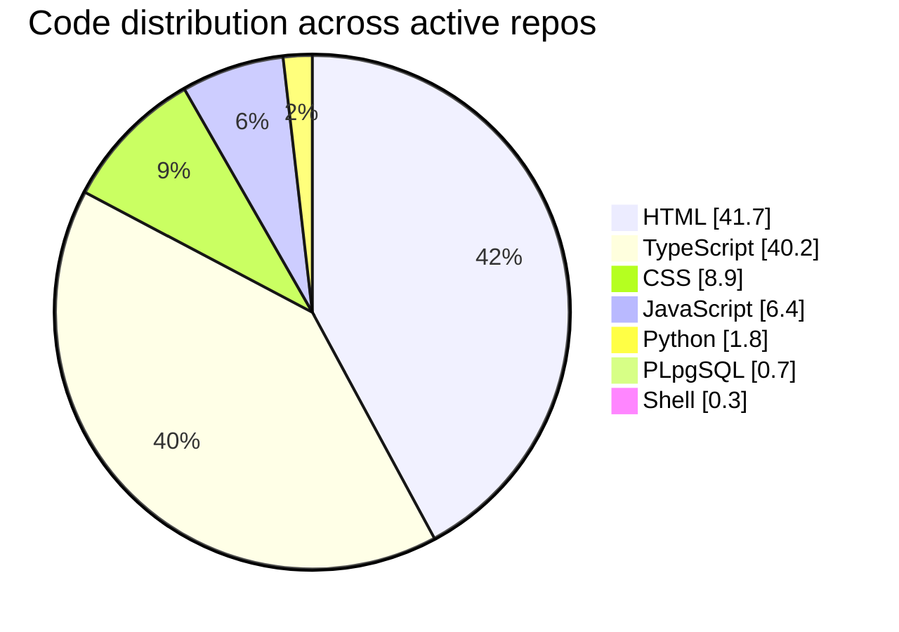

### Hi, I'm Peter — AI educator and founder of [Zynkr](https://www.zynkr.ai).

I came to coding through teaching, not the other way around. Zynkr is how I share what works: a growing marketplace of 90+ Claude skills, vibe-coding curricula, and the agents I use to run my own content and business operations.

> If you're a non-engineer trying to ship real things with AI, this profile is the playbook I'm building in public.

Based in Amsterdam · originally from Taiwan

---

## What I'm Building

### [Zynkr](https://www.zynkr.ai) — AI Skills Marketplace
Browsable directory of 90+ Claude skills for course students. Stack: Next.js + Supabase + Vercel.

### [zynkr-skill-builder](https://github.com/peter-tu-zynkr/zynkr-skill-builder)
Source of truth and ingest pipeline behind zynkr.ai/ai-skills-marketplace. SKILL.md authoring → CI → Supabase mirror → live site.

### [writing-agent](https://github.com/peter-tu-zynkr/writing-agent)
A 7-agent Claude Code pipeline that takes an article from idea → draft → edit → titles → CTA. Powers Zynkr's content team.

### [writing-style-rules](https://github.com/peter-tu-zynkr/writing-style-rules)
Forbidden-phrase database (AI-sounding Chinese clichés) plus a FastAPI/React app to manage them. Used by writing-agent's editor pass.

### [process-livestream](https://github.com/peter-tu-zynkr/process-livestream)
Claude skill that turns livestream recordings into searchable knowledge — transcripts, summaries, agent-driven extraction.

### [Learn-Claude](https://github.com/peter-tu-zynkr/Learn-Claude)
The notes I keep as I learn: Claude Code, MCP, Git, Supabase, Vercel, and the rest of the modern stack. Useful if you're a non-engineer figuring it out alongside me.

---

## Tech I Use Daily

  &nbsp;
  &nbsp;
  &nbsp;
  &nbsp;
  &nbsp;
  &nbsp;
  &nbsp;
  &nbsp;
  &nbsp;
  

### Code distribution across my active repos

HTML + TypeScript split the work down the middle — the static marketing site and the Next.js apps. Python, PLpgSQL, and Shell are the glue (skill ingestion, Supabase migrations, utility scripts). Orange marks the smallest slice — the single decision dot the brand reserves.

---

## Connect

